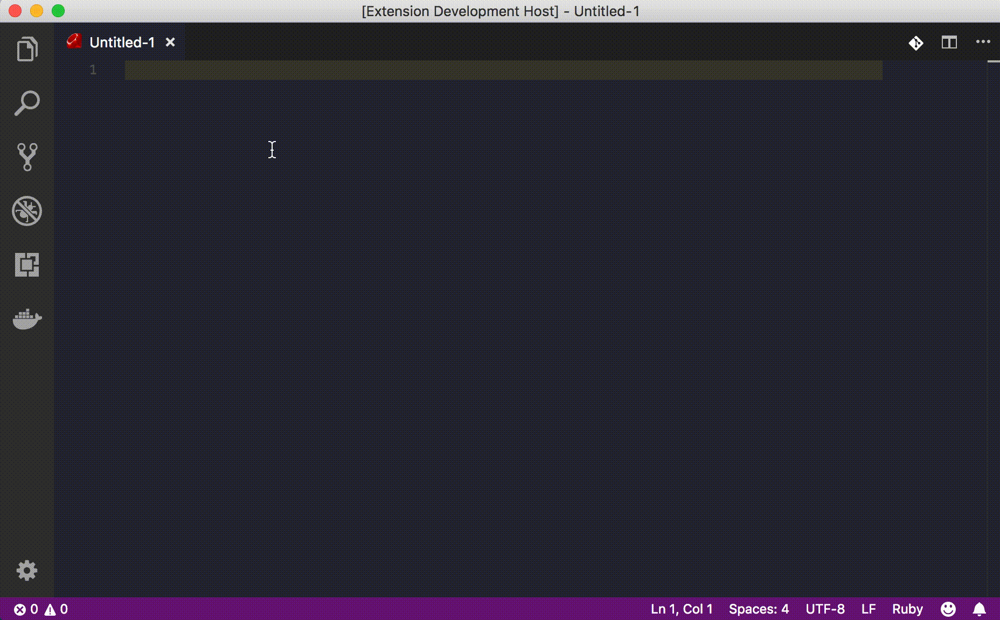

# Cocoapods Snippets for VSCode

A snippet extension for VSCode to set .podspec or .podfile files for CocoaPods.

See the [CHANGELOG](CHANGELOG.md) for the latest changes

## Usage

Type part of a snippet, press `enter`, and the snippet unfolds.

## Installation

1. Install Visual Studio Code 1.10.0 or higher
2. Launch Code
3. From the command palette Ctrl-Shift-P (Windows, Linux) or Cmd-Shift-P (OSX)
4. Select Install Extension
5. Choose the extension
6. Reload Visual Studio Code

## License

MIT

**Enjoy!**
